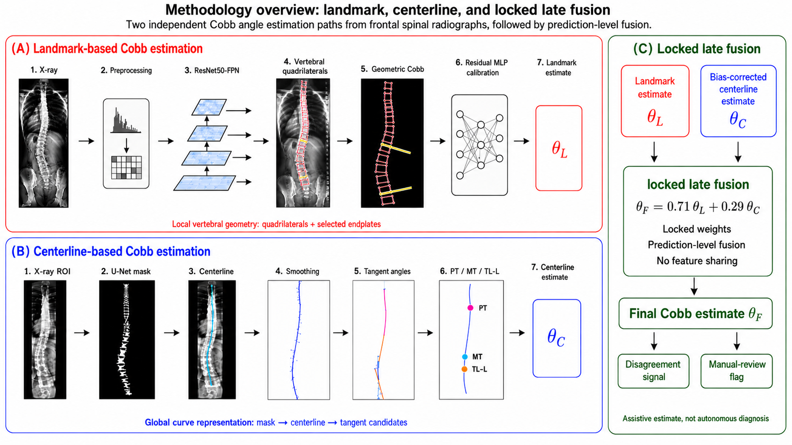
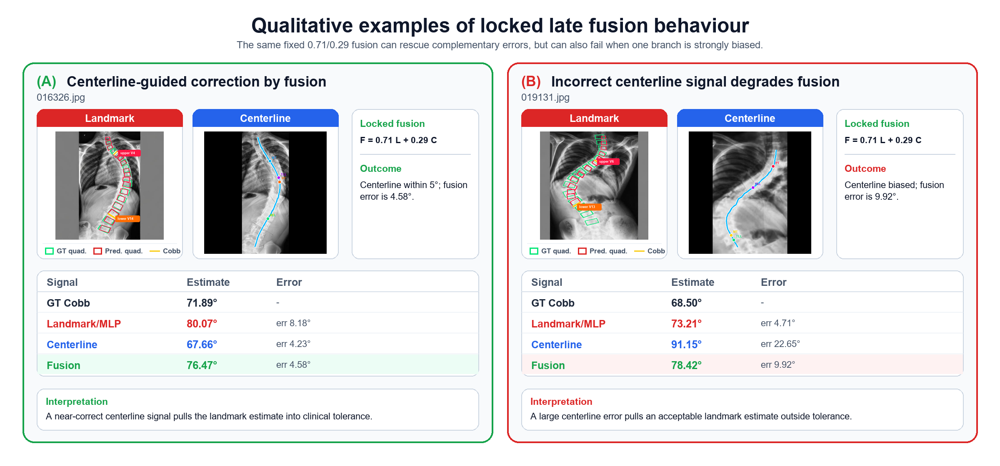

# SPINAL-AI2024-BORGES-LIMA

[](https://github.com/abenjas7/SPINAL-AI2024-BORGES-LIMA/actions/workflows/validate.yml)
[](LICENSE)
[](https://github.com/abenjas7/SPINAL-AI2024-BORGES-LIMA/releases/tag/models-v1)

Interpretable deep learning for automated scoliosis assessment from spinal
radiographs.

This repository is the public, portfolio-ready version of the final Computer
Engineering project developed by Diogo Borges and Daniel Lima. The project
estimates Cobb angles from AP/PA spinal radiographs through explicit geometry:
vertebral landmarks, a centerline model, and a locked late-fusion rule.

The original working repository contained many exploratory experiments, raw
evaluation images, and complete per-image annotations. This version keeps the
final evaluation code, trained models, aggregate reference metrics, and
documentation needed to understand and audit the project without mirroring the
datasets in the active repository tree.

## For Reviewers

The fastest way to evaluate the project as professional AI experience is:

- read the [`Portfolio Case Study`](docs/PORTFOLIO_CASE_STUDY.md) for the
  problem, contribution, results, limitations, and skills demonstrated;
- inspect [`MODEL_CARD.md`](MODEL_CARD.md) for intended use, safety notes, and
  known failure modes;
- run `python run_eval.py metrics-summary` to verify the aggregate reference
  metrics without restoring datasets;
- use the [`models-v1` release](https://github.com/abenjas7/SPINAL-AI2024-BORGES-LIMA/releases/tag/models-v1)
  if Git LFS quota blocks model-weight downloads.

## Dataset Quick Start

The SPINAL-AI2024 radiographs are public upstream, but they are not mirrored in
this repository. For image-level reruns, clone the upstream dataset next to this
repository and run the preparation helper:

```powershell
git clone --depth 1 https://github.com/Ernestchenchen/Spinal-AI2024.git ..\Spinal-AI2024
python scripts/prepare_spinal_ai2024_subset5.py --upstream ..\Spinal-AI2024
python run_eval.py check-data
```

The helper copies the test radiographs from upstream `Spinal-AI2024-subset5/`
into `raw/images/test/Spinal-AI2024-subset5/` and rebuilds
`processed/cleaned/test_ready_annotations_clean.json` from the public COCO
annotation zip plus Cobb ground-truth text file.



## What This Project Does

- Detects vertebral quadrilateral landmarks and estimates Cobb geometry from
  local endplates.
- Extracts a spine centerline and estimates curve angles from tangent/derivative
  signals.
- Applies a locked late fusion selected on an internal holdout:
  `F = 0.71 * LandmarkMLP + 0.29 * CenterlineCorrected`.
- Evaluates both controlled benchmark performance and real-domain transfer.

The system is an academic research artifact, not a medical device.

## Main Contributions

| Component | Main idea | Role in the project |
|---|---|---|
| Landmark pipeline | ResNet50/FPN vertebral candidates, anatomical sequencing, quadrilateral landmarks, geometric Cobb estimate, residual MLP calibration | High-accuracy local vertebral geometry |
| Centerline pipeline | U-Net-style centerline extraction with tangent/derivative angle estimation | Complementary global curve signal |
| Locked fusion | Fixed holdout-selected weighted average | Combines local and global geometry without test-set tuning |
| Domain audit | AASCE 2019 zero-shot evaluation and GT-landmark audit | Separates geometry correctness from real-image model shift |



## Reference Results

The main full-run reference outputs are stored under `experiments/reference/`.

| Evaluation | N | MAE | SMAPE | Within 5 deg |
|---|---:|---:|---:|---:|
| Landmark MLP v2, SPINAL-AI2024 subset5 | 3988 | 2.3448 deg | 5.3120% | 91.55% |
| Centerline raw max Cobb, SPINAL-AI2024 subset5 | 3988 | 6.3969 deg | 20.2466% | 38.47% |
| Centerline bias-corrected fusion input, SPINAL-AI2024 subset5 | 3988 | 3.0513 deg | 7.1079% | 85.38% |
| Locked fusion v3, SPINAL-AI2024 subset5 | 3988 | 2.2140 deg | 5.0215% | 93.33% |
| AASCE fusion, real zero-shot | 323 covered / 481 total | 18.4423 deg | 26.5564% | 15.79% on covered rows |
| AASCE GT-landmark geometry audit | 481 | 2.3069 deg | 3.5775% | 95.63% |

The AASCE result is intentionally reported as zero-shot domain transfer. The
GT-landmark audit shows that the Cobb geometry implementation remains accurate
when landmarks are reliable, while learned image predictions degrade under the
real-image domain shift.

## Repository Layout

```text
models/
  final trained Keras weights and calibration scaler

scripts/
  final evaluation and model scripts used by the project

experiments/reference/
  aggregate metric JSON files from the final full runs

experiments/fusion_centerline_mlp_v3_holdout3192/
  locked fusion configuration selected on the holdout split

processed/cleaned/
  local placement for restored SPINAL-AI2024 annotations

external_datasets/ascee_aasce2019/processed/
  aggregate AASCE preparation summary and local manifest placement

docs/assets/
  presentation-quality project figures

run_eval.py
  convenience wrapper for reproducibility checks
```

Raw radiographs, complete cleaned annotations, and per-image prediction CSVs are
not redistributed in the active tree. See [`DATASET_ACCESS.md`](DATASET_ACCESS.md)
and [`DATA_LICENSE.md`](DATA_LICENSE.md) before restoring any dataset locally.

## Setup

Use Python 3.10 or 3.11 if possible.

```powershell
git clone https://github.com/abenjas7/SPINAL-AI2024-BORGES-LIMA.git
cd SPINAL-AI2024-BORGES-LIMA
git lfs pull

python -m venv .venv
.\.venv\Scripts\Activate.ps1
python -m pip install --upgrade pip
pip install -r requirements.txt
```

Large model weights are tracked with Git LFS. If Git LFS was not installed
before cloning, install it and run:

```powershell
git lfs install
git lfs pull
```

If the GitHub LFS quota is exhausted, download the model archive attached to the
`models-v1` release and extract it into the repository root. If a `.keras` file
starts with `version https://git-lfs.github.com/spec/v1`, it is still only an
LFS pointer.

## Raw-Data-Free Check

This command prints the aggregate reference metrics kept in the repository. It
does not require raw radiographs or per-image annotations.

```powershell
python run_eval.py metrics-summary
```

To check whether the optional local subset5 data has been restored:

```powershell
python run_eval.py check-data
```

## Full Evaluation Commands

The commands below require the corresponding raw datasets and annotation
artefacts to be restored locally according to [`DATASET_ACCESS.md`](DATASET_ACCESS.md).

```powershell
python run_eval.py subset5-diogo --num-images 8
python run_eval.py subset5-daniel --num-images 8
python run_eval.py subset5-fusion --num-images 8
python run_eval.py aasce-fusion --num-images 8
```

For full evaluations, pass `--num-images 0`:

```powershell
python run_eval.py subset5-diogo --num-images 0
python run_eval.py subset5-daniel --num-images 0
python run_eval.py subset5-fusion --num-images 0
python run_eval.py aasce-fusion --num-images 0
```

Full runs can be slow on CPU because they load TensorFlow models and process
thousands of images.

## Project Notes

- The fusion lock was selected on the internal holdout split and applied
  unchanged to the final subset5 and AASCE evaluations.
- Ground truth labels are used for metric computation and audits, not for final
  inference-time Cobb prediction.
- The landmark and centerline methods were deliberately chosen as complementary
  geometric representations: local vertebral endplates versus global curve
  shape.
- The datasets used by the project are upstream-accessible, but not mirrored in
  this repository because the public availability terms do not clearly grant
  third-party redistribution rights.

## License And Data

Code is released under the MIT License. Dataset access, radiographs, annotations,
and model weight reuse are documented separately in
[`DATASET_ACCESS.md`](DATASET_ACCESS.md) and [`DATA_LICENSE.md`](DATA_LICENSE.md).

The outputs are for research, reproducibility, and portfolio review only. They
must not be used as autonomous clinical diagnoses.

