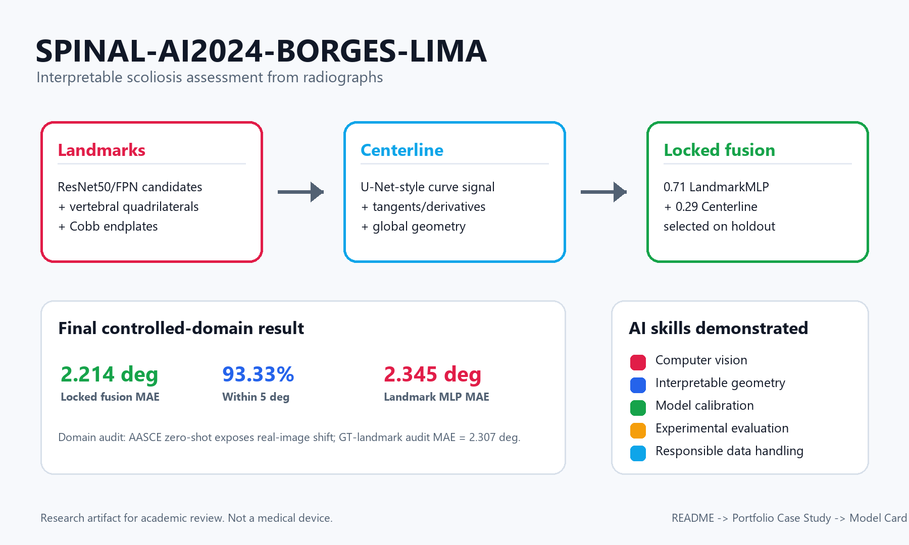

# Portfolio Case Study

## Project In One Minute

This project estimates Cobb angles from AP/PA spinal radiographs using
interpretable geometric signals rather than a direct black-box angle regressor.
It combines two complementary representations:

- local vertebral landmarks, used to recover endplates and Cobb geometry;
- global spine centerline, used to estimate curve angles from tangents;
- a fixed late-fusion rule selected on a holdout split.

The result is a reproducible academic research artifact for scoliosis
measurement, with trained models, aggregate metrics, model documentation, and
dataset restoration instructions available in the repository.

## Why The Problem Matters

Manual Cobb angle measurement is clinically meaningful but time-consuming and
operator-dependent. A useful automated system should therefore be accurate,
auditable, and able to expose the geometric evidence behind the angle estimate.

The project deliberately avoids treating scoliosis assessment as only a scalar
regression problem. Instead, it predicts visible anatomical structures first and
computes the angle from those structures.

## Technical Approach

| Component | Purpose | Main technical idea |
|---|---|---|
| Landmark pipeline | Estimate local vertebral geometry | ResNet50/FPN vertebral candidates, anatomical sequencing, quadrilateral landmarks, Cobb endpoint selection, residual MLP calibration |
| Centerline pipeline | Estimate global curve shape | U-Net-style centerline extraction and tangent/derivative-based angle estimation |
| Locked fusion | Combine complementary signals | Fixed `0.71 * LandmarkMLP + 0.29 * CenterlineCorrected`, selected on holdout and applied unchanged to test |
| Domain audit | Stress-test real-image transfer | AASCE 2019 zero-shot evaluation plus GT-landmark geometry audit |

## My Main Contribution

My work focused on the landmark-based pipeline and its integration into the
final project:

- trained and evaluated vertebral landmark models for quadrilateral prediction;
- implemented anatomical post-processing to select a plausible vertebral
  sequence;
- computed Cobb geometry from predicted endplates and selected endpoints;
- added a residual MLP calibration layer to correct systematic geometric error;
- produced final subset5 evaluations, qualitative overlays, and reusable
  evaluation scripts;
- integrated the landmark signal with the centerline model through a locked
  late-fusion rule.

This contribution demonstrates applied computer vision, geometric reasoning,
model calibration, experimental discipline, and reproducible ML engineering.

## Results

| Evaluation | N | MAE | SMAPE | Within 5 deg |
|---|---:|---:|---:|---:|
| Landmark MLP v2, SPINAL-AI2024 subset5 | 3988 | 2.3448 deg | 5.3120% | 91.55% |
| Centerline bias-corrected, SPINAL-AI2024 subset5 | 3988 | 3.0513 deg | 7.1079% | 85.38% |
| Locked fusion v3, SPINAL-AI2024 subset5 | 3988 | 2.2140 deg | 5.0215% | 93.33% |
| AASCE fusion, real zero-shot | 323/481 | 18.4423 deg | 26.5564% | 15.79% |
| AASCE GT-landmark geometry audit | 481 | 2.3069 deg | 3.5775% | 95.63% |

The subset5 results show strong controlled-domain performance. The AASCE
zero-shot result shows a major real-domain drop, while the GT-landmark audit
shows that the Cobb geometry itself remains reliable when landmark inputs are
accurate. This separation is important: the main limitation is image-domain
shift, not the angle computation formula.

## Engineering Quality

The public repository was prepared for external review:

- code, trained models, aggregate metrics, and model documentation are included;
- raw radiographs and complete per-image annotations are not redistributed;
- dataset restoration is documented through `DATASET_ACCESS.md`;
- aggregate metrics can be checked without datasets using
  `python run_eval.py metrics-summary`;
- full image-level evaluation commands are available when datasets are restored
  locally.

## Limitations And Lessons

- Severe curves and very high Cobb angles are harder because vertebrae may be
  rotated, partially visible, or outside the training distribution.
- Real radiographs introduce domain shift not solved by synthetic benchmark
  performance alone.
- The landmark pipeline is interpretable, but errors in vertebral detection
  propagate into endpoint selection.
- The centerline signal is complementary, but can degrade fusion when strongly
  biased.

These limitations were documented rather than hidden, because they are central
to responsible AI evaluation in medical-imaging contexts.

## What To Inspect First

- `README.md` for setup, metrics, and reproducibility commands.
- `MODEL_CARD.md` for intended use, limitations, and safety notes.
- `DATASET_ACCESS.md` for dataset restoration.
- `experiments/reference/` for aggregate metric JSON files.
- `deployment/spinal_ai_inference.py` for the inference-facing implementation.
